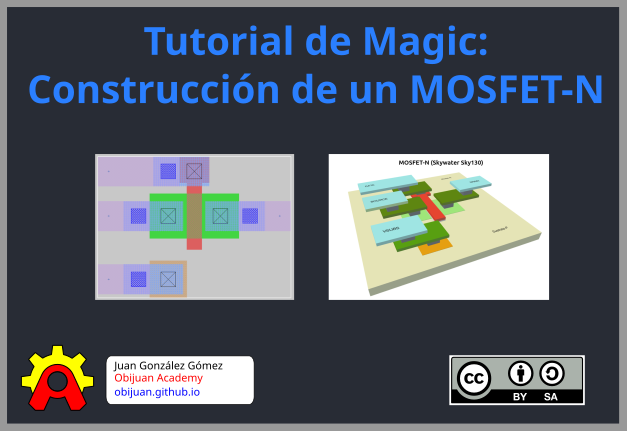

# Introducción

[Magic](https://github.com/RTimothyEdwards/magic) es un programa Libre para **diseñar y fabricar** circuitos integrados utilizando diferentes tecnologías

En este tutorial vamos a ver cómo diseñar el layout de un **transistor MOSFET-N**, utilizando la [tecnología Libre Sky130](https://github.com/gdsfactory/skywater130), cómo **simularlo** y cómo generar el **fichero GDS** para su **fabricación**. En la parte final utilizaremos la herramienta [KLayout](https://www.klayout.de/) para mostrar el diseño tanto en 2D como en **3D**

