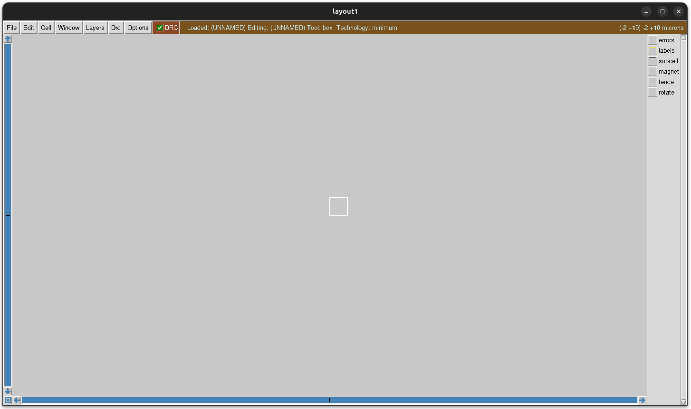
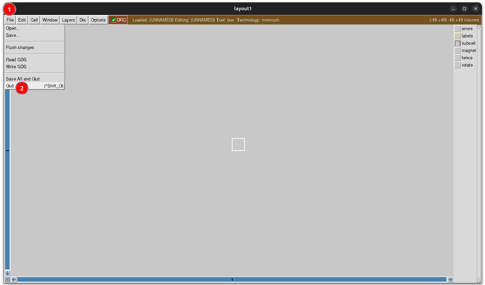

# Instalación

En este tutorial utilizaremos [Magic](https://github.com/RTimothyEdwards/magic) junto con la [Tecnología sky130](https://github.com/gdsfactory/skywater130)  , que es la que podemos fabricar. Tenemos que realizar **2 instalaciones**:

* La herramienta [Magic](https://github.com/RTimothyEdwards/magic) 
* La [Tecnología sky130](https://github.com/gdsfactory/skywater130)  

## Instalación de Magic

La manera más directa de instalar mágic, usando la última versión, es utilizando el ejecutabe **appimage** que se encuentra en la zona de las Releases: [https://github.com/RTimothyEdwards/magic/releases](https://github.com/RTimothyEdwards/magic/releases)

La que usamos para este tutorial es la versión **8.3.681**

Descargamos el ejecutable appimage correspondiente, que en nuestro caso es: [Magic-8.3.681.20260807.4432d7ec-x86_64-EL10.AppImage](https://github.com/RTimothyEdwards/magic/releases/download/8.3.681/Magic-8.3.681.20260807.4432d7ec-x86_64-EL10.AppImage)


Lo renombramos a `magic` y lo copiamos en un directorio accesible desde el path. Yo voy a instalarlo en `~/.local/bin`

Para comprobar que arranca correctamente abrimos un terminal y escribimos `magic`:

```bash
obijuan@JANEL:~$ magic
-- # Starting Magic
```

Esto es lo que nos aparece:



De momento vamos a **Cerrar** la aplicación, pinchando en **File/Quit**



¡Ya tenemos Magic funcionando!

## Instalando el gestor ciel

Magic es un programa para **diseño de chips** que puede trabajar con **diferentes tecnologías**, o [PDK](https://www.zerotoasiccourse.com/terminology/pdk/) (Process Design Kit), proporcionados por los fabricantes

Nosotros estamos interesados en trabajar con [OPEN PDKs](https://github.com/fossi-foundation/open-pdks), que han sido liberados por el fabricante. En concreto, usaremos el [Sky130](https://github.com/gdsfactory/skywater130) de Skywater

Para su instalación hay que realizar **compilaciones**. Todo esto se simplifica si usamos un **gestor de paquetes**, que nos instala la versión ya compilada, para el PDK que necesitemos

El gestor recomendado es [ciel](https://github.com/fossi-foundation/ciel)

Para instalar **ciel** seguimos estos pasos:

1. **Crear un entorno virtual de python**  
  Ciel es un paquete **python**, por lo que en vez de instalarlo directamente en el sistema, vamos a crear el entorno virtual **asic**, y dentro de él lo instalaremos

```bash
obijuan@JANEL:~$ python -m venv $HOME/venv/asic
```

2. **Entrar en el entorno virtual**
```bash
obijuan@JANEL:~$ . $HOME/venv/asic/bin/activate
(asic) obijuan@JANEL:~$
```

3. **Instalación de ciel**

```bash
(asic) obijuan@JANEL:~$ python3 -m pip install ciel
```

Una vez instalado realizamos una **comprobación** para verificar que efectivamente se ha instalado correctamente

```bash
(asic) obijuan@JANEL:~$ ciel --version
Ciel v2.6.1 ©2022-2025 Efabless Corporation and Contributors

Licensed under the Apache License, Version 2.0 (the "License");
you may not use this program except in compliance with the License.
You may obtain a copy of the License at

    http://www.apache.org/licenses/LICENSE-2.0

Unless required by applicable law or agreed to in writing, software
distributed under the License is distributed on an "AS IS" BASIS,
WITHOUT WARRANTIES OR CONDITIONS OF ANY KIND, either express or implied.
See the License for the specific language governing permissions and
limitations under the License.
(asic) obijuan@JANEL:~$
```

## Instalación de sky130

Desde Ciel comprobamos los PDKs precompilados listos para instalar, con el comando `ciel ls-remote --pdk-family sky130`:

```bash
(asic) obijuan@JANEL:~$ ciel ls-remote --pdk-family sky130
Pre-built sky130 PDK versions
├── 026824c7969ce6f4fc9678e6ca04b0a06a596c4b (2026.08.04)
├── f6eeac7dad085ffcc829ccfd721f7b4ce39edcf7 (2026.07.14)
├── d658698bd8bcf4e05fc7b5991a701247ba0d744c (2026.07.04)
[...]
```
Salen muchos, pero sólo hemos mostrado los 3 primeros

Con el comando `ciel ls --pdk-family sky130` comprobamos los que están instalados:

```bash
(asic) obijuan@JANEL:~$ ciel ls --pdk-family sky130
No PDKs installed.
(asic) obijuan@JANEL:~$
```

Como es la primera instalación, de momento NO nos aparece **ninguno**. Vamos a instalar el último (2026.08.04). Hay que utilizar su hash:

```bash
(asic) obijuan@JANEL:~$ ciel enable --pdk-family sky130 026824c7969ce6f4fc9678e6ca04b0a06a596c4b
Version 026824c7969ce6f4fc9678e6ca04b0a06a596c4b not found locally, attempting 
to download…
Downloading common.tar.zst… ━━━━━━━━━━━━━━━━━━━━━━━━━━━━━━━━━━━━━━━ 100% 0:00:00
Downloading sky130_fd_io.tar.zst… ━━━━━━━━━━━━━━━━━━━━━━━━━━━━━━━━━ 100% 0:00:00
Downloading sky130_fd_pr.tar.zst… ━━━━━━━━━━━━━━━━━━━━━━━━━━━━━━━━━ 100% 0:00:00
Downloading sky130_fd_sc_hd.tar.zst… ━━━━━━━━━━━━━━━━━━━━━━━━━━━━━━ 100% 0:00:00
Downloading sky130_fd_sc_hvl.tar.zst… ━━━━━━━━━━━━━━━━━━━━━━━━━━━━━ 100% 0:00:00
Downloading sky130_ml_xx_hd.tar.zst… ━━━━━━━━━━━━━━━━━━━━━━━━━━━━━━ 100% 0:00:00
Downloading sky130_sram_macros.tar.zst… ━━━━━━━━━━━━━━━━━━━━━━━━━━━ 100% 0:00:00
Version 026824c7969ce6f4fc9678e6ca04b0a06a596c4b enabled for the sky130 PDK.
(asic) obijuan@JANEL:~$
```

Ahora ya sí que aparece que tengo uno instalado:

```bash
(asic) obijuan@JANEL:~$ ciel ls --pdk-family sky130
In /home/obijuan/.ciel/ciel/sky130/versions:
└── 026824c7969ce6f4fc9678e6ca04b0a06a596c4b (2026.08.04) (enabled)
(asic) obijuan@JANEL:~$
```

Todos los ficheros relacioandos con el PDK de Sky130 se encuentran en el directorio `~/.ciel/sky130A`

¡¡Ya lo tenemos todo listo!!


