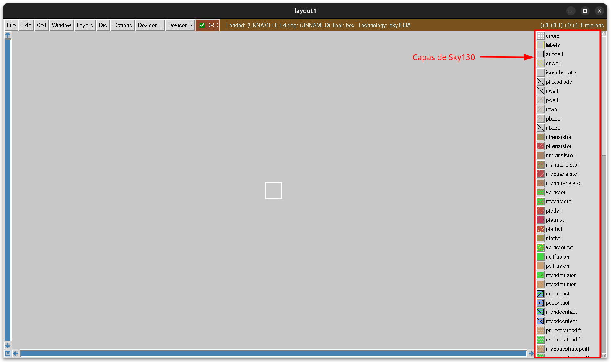
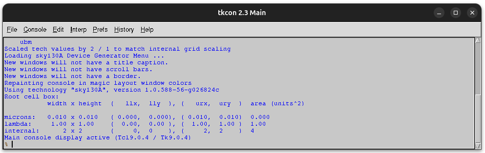

# Arrancando Magic

Para arrancar Magic seguimos estos pasos:

1. Exportar la variable **PDK_ROOT**:  `export PDK_ROOT=$HOME/.ciel`

```bash
(asic) obijuan@JANEL:~/Develop/Tutorial-Magic$ export PDK_ROOT=$HOME/.ciel
```

2. Arrancar Magic con `magic -rc ~/.ciel/sky130A/libs.tech/magic/sky130A.magicrc`

Hay que arrancar Magic pasándole como argumento un script de arranque para configurar la Tecnología sky130

```bash
(asic) obijuan@JANEL:~/Develop/Tutorial-Magic$ magic -rc ~/.ciel/sky130A/libs.tech/magic/sky130A.magicrc
-- # Starting Magic
```

Esto es lo que nos aparece ahora



En la parte de la derecha vemos TODAS las capas definidas para trabajar con la **tecnología Sky130**

Además, hay una **segunda ventana** de Magic: la **Consola de Magic**. Aquí es donde Magic nos saca sus mensajes de salida y donde el usuario puede **escribir comandos**



Esta es toda la información que aparece inicialmente en la consola de Magic, que se deja aquí como referencia

```bash
loading history file ... 3 events added
Use openwrapper to create a new GUI-based layout window
Use closewrapper to remove a new GUI-based layout window

Magic 8.3 revision 681 - Compiled on Sat Aug  8 07:04:03 UTC 2026.
Starting magic under Tcl interpreter
Using Tk console window
Using TrueColor, VisualID 0x21 depth 24
Processing system .magicrc file
Switching to WIRING tool.
Switching to NETLIST tool.
Switching to PICK tool.
Switching to BOX tool.
Sourcing design .magicrc for technology sky130A ...
2 Magic internal units = 1 Lambda
Input style sky130(): scaleFactor=2, multiplier=2
The following types are not handled by extraction and will be treated as non-electrical types:
    ubm 
Scaled tech values by 2 / 1 to match internal grid scaling
Loading sky130A Device Generator Menu ...
New windows will not have a title caption.
New windows will not have scroll bars.
New windows will not have a border.
Repainting console in magic layout window colors
Using technology "sky130A", version 1.0.588-56-g026824c
Root cell box:
           width x height  (   llx,  lly  ), (   urx,  ury  )  area (units^2)

microns:   0.010 x 0.010   ( 0.000,  0.000), ( 0.010,  0.010)  0.000     
lambda:     1.00 x 1.00    (  0.00,  0.00 ), (  1.00,  1.00 )  1.00      
internal:      2 x 2       (     0,  0    ), (     2,  2    )  4         
Main console display active (Tcl9.0.4 / Tk9.0.4)
% 
```

¡Ya está todo listo para comenzar el tutorial!
