# Preparativos iniciales

Antes de diseñar nuestro **primer MOSFET-N**, vamos a ir **configurando** Magic, así como aprendiendo su **interfaz**

Magic es un programa **antiguo**, aunque muy potente. Por ello la interfaz resulta actualmente un poco **exraña**. Sin embargo, cuando se aprenden sus fundamentos, resulta **muy sencilla**

PERO es **muy importante** leer esta documetanción y NO intentar hacer nada por tu cuenta

## Ventana principal

Al arrancar Magic como se indica en el apartado anterior, nos aparece **la ventana principal**

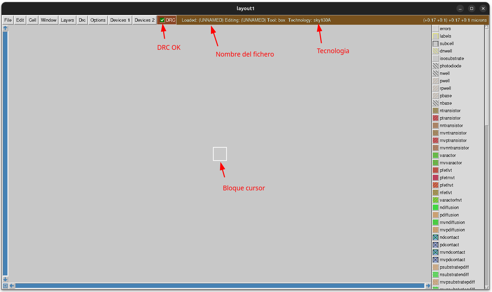


Esta es la pantalla donde haremos nuestro **diseño**. Vamos a destacar algunos de los elementos de la interfaz

* **DRC**: Reglas de diseño. Se indica si se están violando o no las reglas de diseño del chip, con la tecnología actual. Inicialmente no hay diseño, y por eso no se están violando ninguna de las reglas de diseño. Aparece un check en verde
* **Nombre del diseño** actualmente cargado. Por defecto es **UNLOADED**
* **Tecnología**: Sky130A
* **Bloque cursor**: Zona del chip con la zona **activa**, donde afectarán los diferentes comandos que se usen

Una cosa muy importante es que los elementos de diseño dentro del chip siempre son **zonas rectangulares**. Por eso el cursor es un bloque, que puede tener las dimensiones que le demos, pero siempre es **un rectángulo**. No es posible crear otras geometrías diferentes a rectángulos

El **bloque cursor** lo vamos a nombre como **la caja**

Las unidades por defecto que vamos a utilizar son **micrómetros** (µm), que en magic se usa el **prefijo um**. Las dimensiones de la caja por defecto, la que aparece al inicio son de **0.010um x 0.010um**


## Haciendo zoom

Cuando se trabaja con programas de diseño visuales, es importantísimo conocer el manejo de la **cámara**, y saber cómo **acercarse** para ver detalles, **alejarse** para ver más información, así como **centrar** la vista actual. En Magic todo esto se realiza **mediante teclas**. NO SE HACE CON EL RATÓN, como en los programas modernos

> [!NOTE]
> Recordemos que Magic es un programa desarrollado hace décadas, donde todavía el ratón era un elemento que podía NO estar presente en los ordenadores. Por eso está todo pensado para hacerse con el teclado

Para **hacer zoom** y acercarnos a un detalle de nuestro diseño pulsamos en la tecla `z`. Vemos que ahora **la caja** se ve más grande


Para **alejar el zoom** (zoom out) y visualizar más información de nuestro diseño pulsamos `shift-z`


Podemos **centrar** la caja con la tecla `ctrl-z`

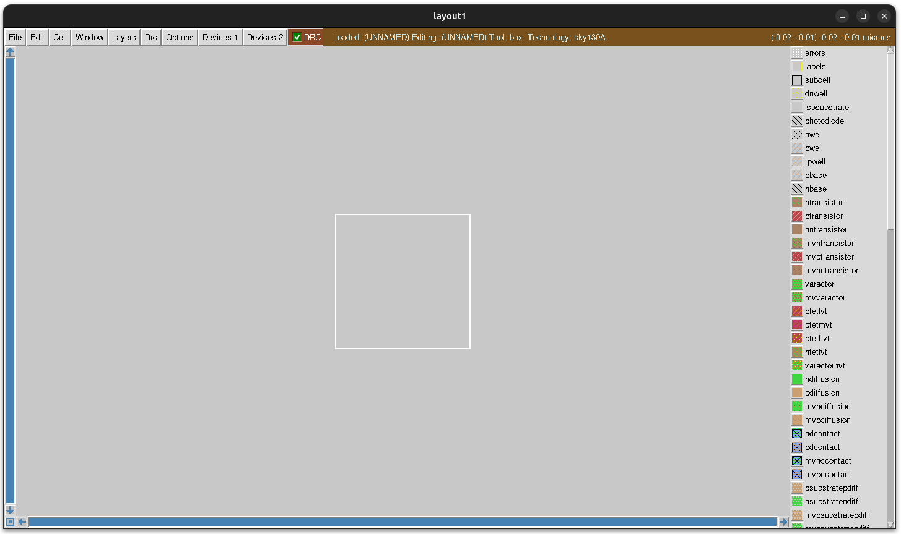


Aunque conviene tener siempre en la cabeza estas teclas, también se encuentran disponibles en el menú **windows**
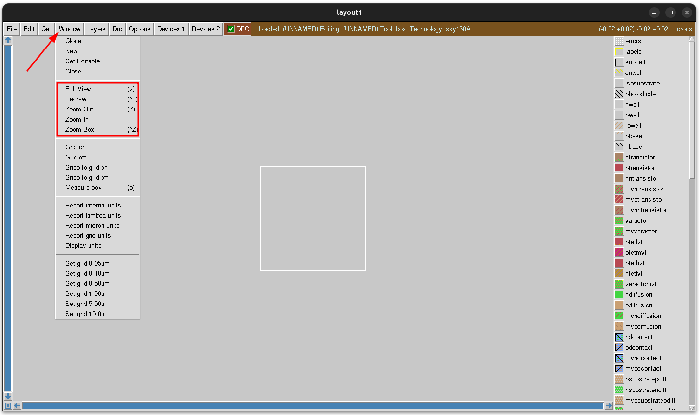


## Configurando el grid

Antes de empezar a diseñar vamos **configurar el grid**. Magic es un programa de **diseño 2D**, donde los elementos que se añaden son siempre **rectángulos**. Por eso resulta muy conveniente definir una **cuadrícula** (grid) y configurarla para el tamaño más adecuado según la tecnología que estamos usando.

Nosotros vamos a establecer la **resolución de la cuadrícula** en 0.05µm (50nm). Pinchamos en **windows** y luego **Set grid 0.05um**

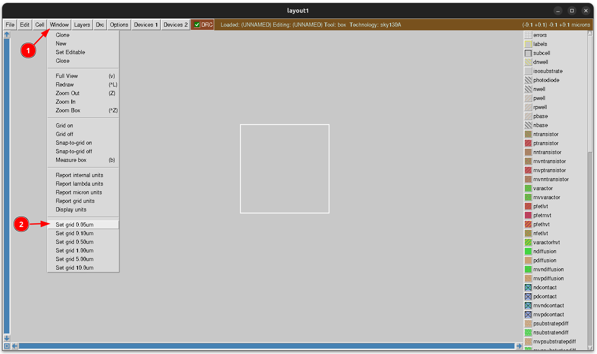
 

Se activa automáticamente, y veremos la cuadrícula:


Si echamos el zoom hacia atrás vemos más cuadrículas

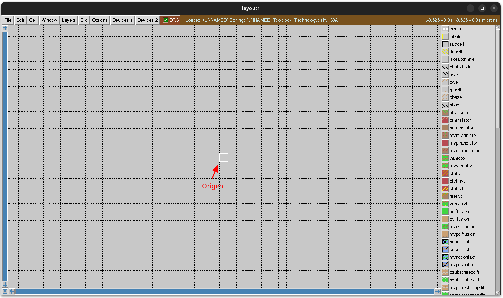

Hay un **punto negro** en la esquina inferior izquierda de la caja. Indica donde se encuentra el **origen de coordenadas** (0, 0)  
Ahora pinchamos en la opción **windows/Snap-to-grid-on** para que la caja esté siempre sobre el grid. Esto facilita mucho el trabajo con los diseños

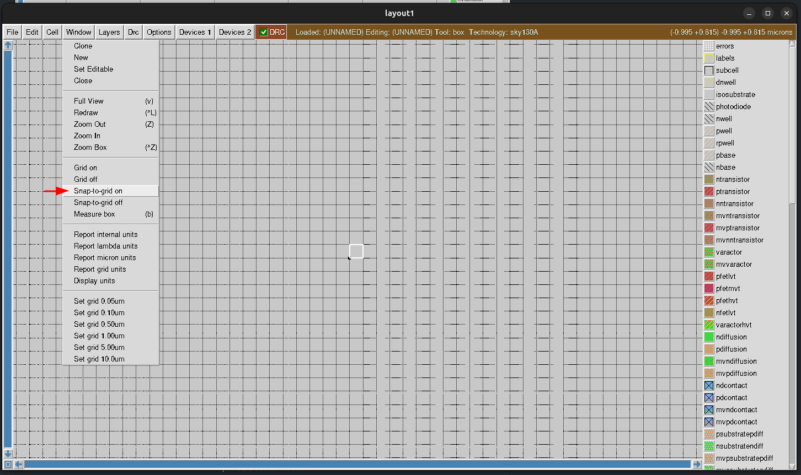


## Midiendo el tamaño de la caja

La **caja** resalta la **zona activa** dentro del diseño, que es siempre un rectángulo. Esta caja la podemos agrandar y cambiar, como veremos más adelante, para señalar la zona de interés

Para saber el tamaño que tiene esta caja, y por tanto saber el tamaño de la zona de interés, utilizamos la opción  **Windows/Measure box** o apretamos la tecla `b`. Nos apareceren las dimensiones en la ventana de texto:

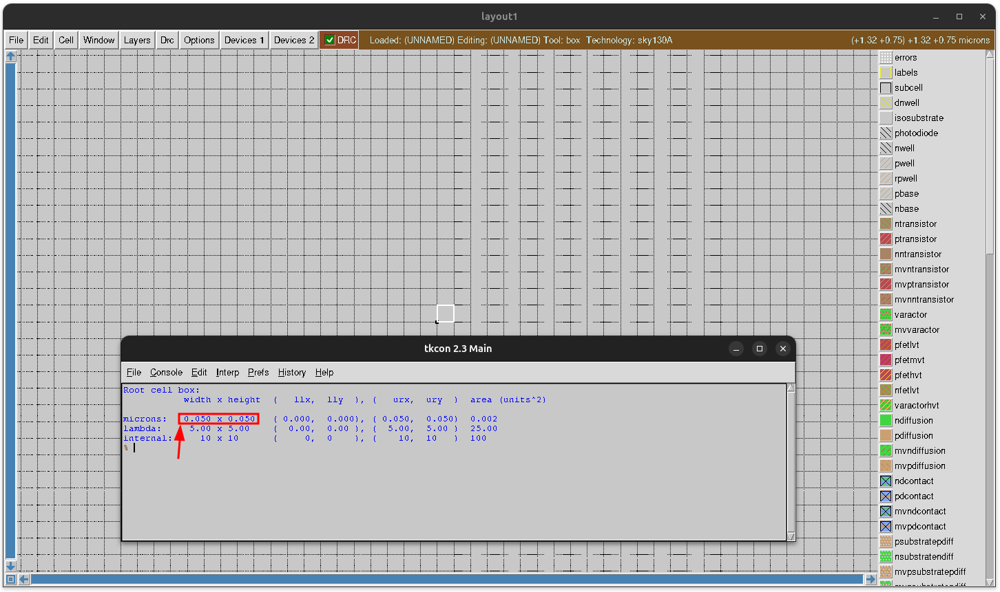

La caja por defecto tiene el tamaño de una celda del grid, que comprobamos que es de 0.05umx0.05um

Otra forma de obtener el tamaño de la **caja** es escribiendo el comando `box`

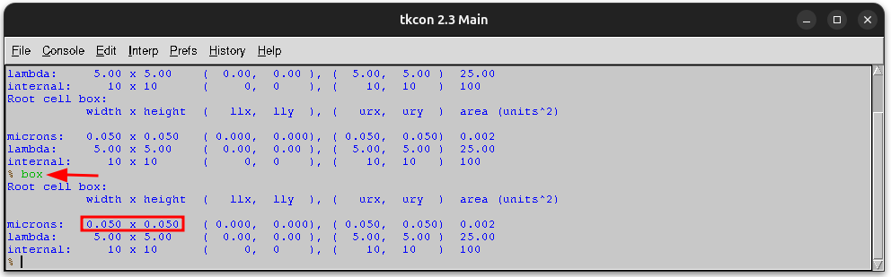


## Guardando el diseño en un fichero
  
En este tutorial vamos a construir un mosfet N. El diseño actual, que está en blanco, lo guardamos en el fichero `mosfet-n.mag`, que contendrá nuestro mosfet futuro. Para ello pinchamos en **cell/save as**

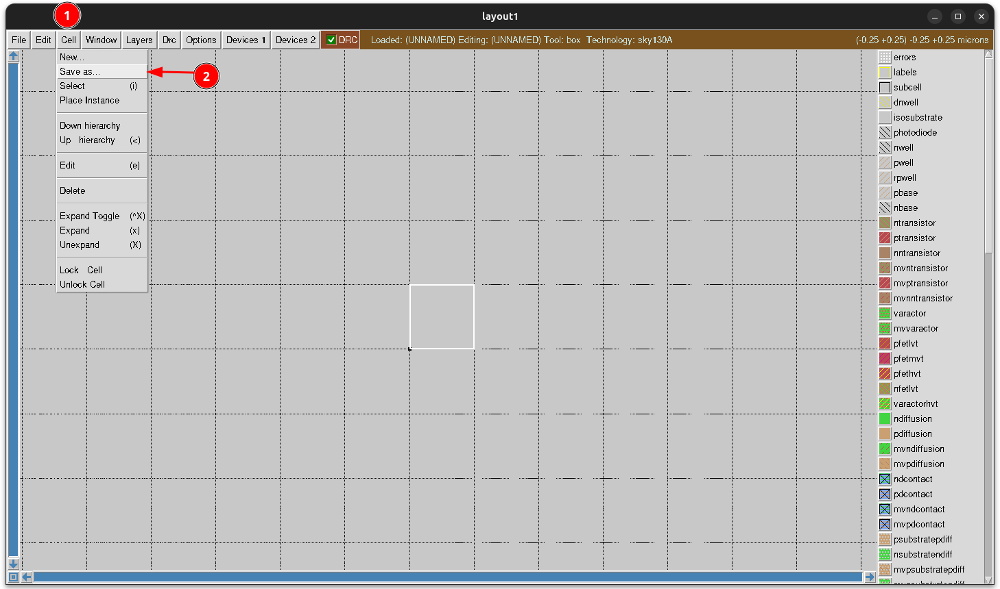

Se nos abre una ventana de diálogo donde escribimos el nombre del diseño. Escribimos `mosfet-n` y pinchamos en **ok**

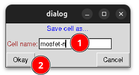

Vemos en la parte superior cómo ha cambiado el nombre a **mosfet-n**

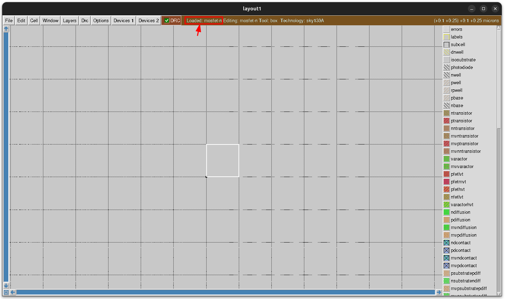


También se nos ha generado el fichero `mosfet-n.mag` en el directorio de trabajo

```bash
obijuan@JANEL:~/Develop/Tutorial-Magic/src/examples$ ls
mosfet-n.mag
obijuan@JANEL:~/Develop/Tutorial-Magic/src/examples$
```
El diseño es un fichero de texto, que podemos ver y editar:

```
magic
tech sky130A
timestamp 0
<< end >>
```

