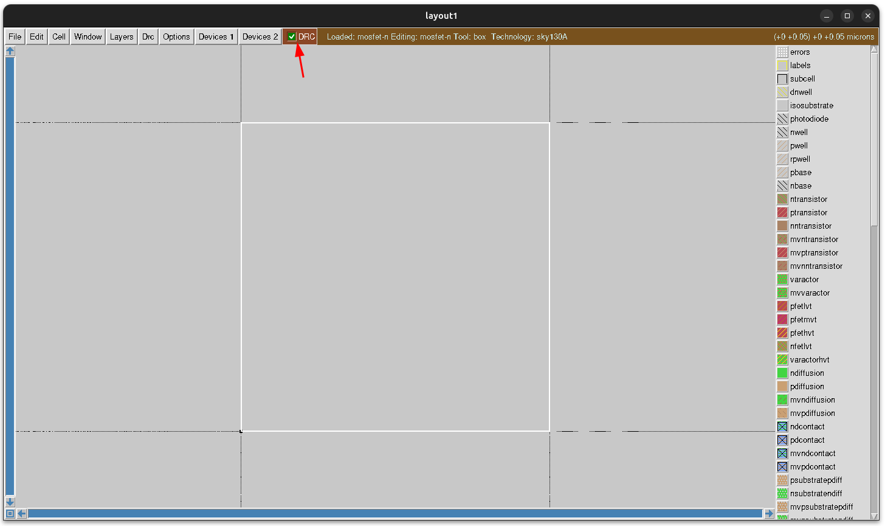
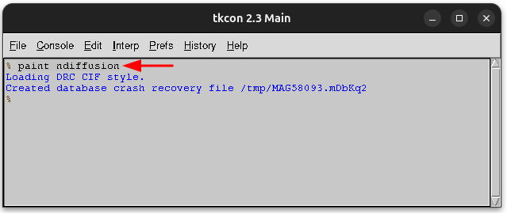
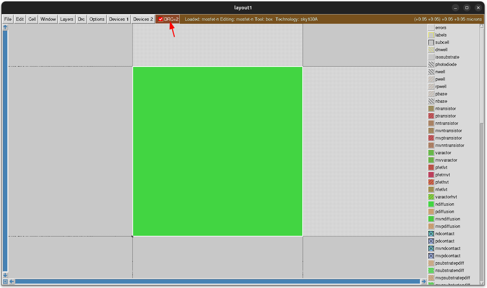
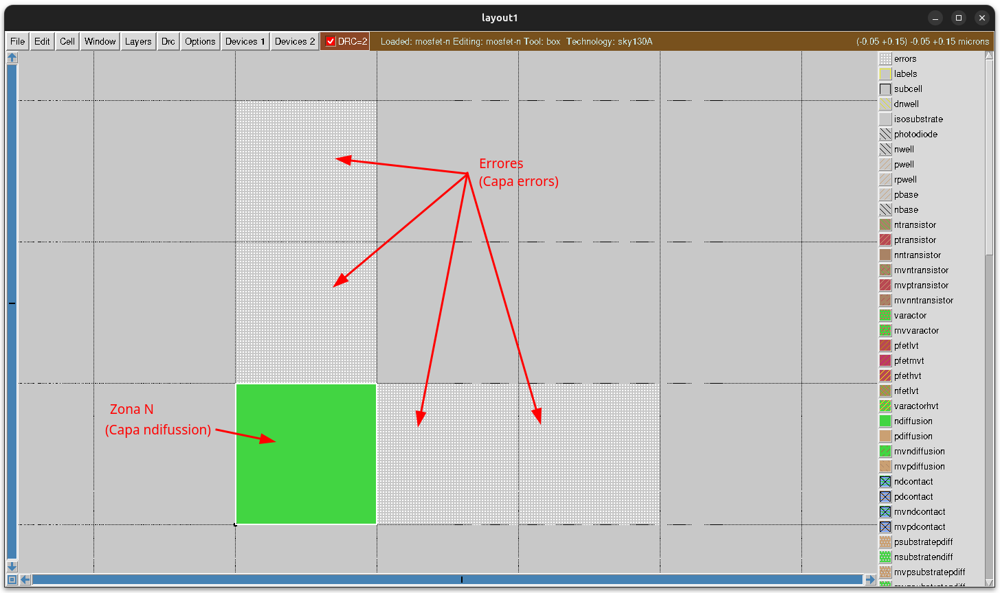
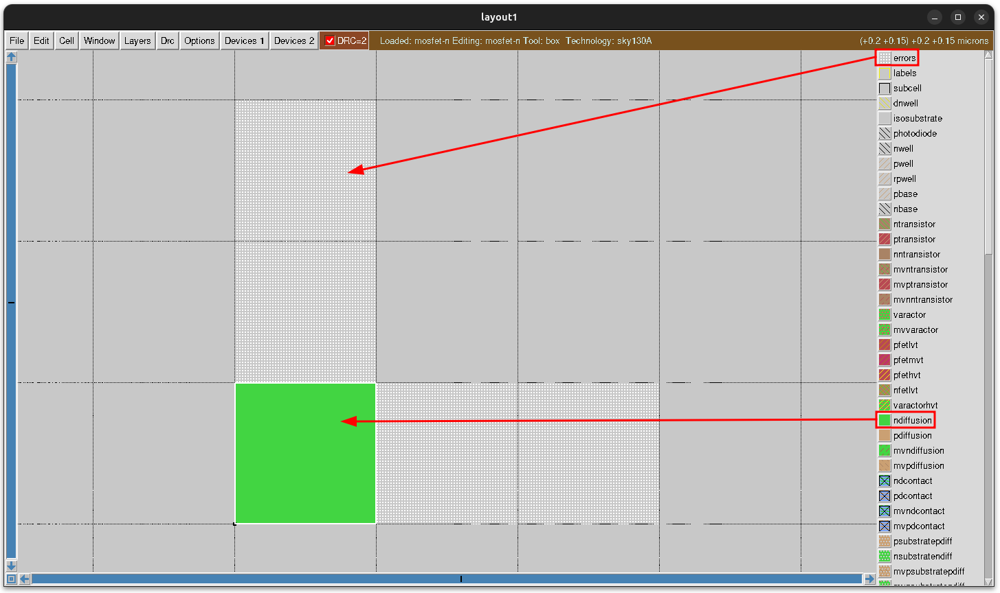
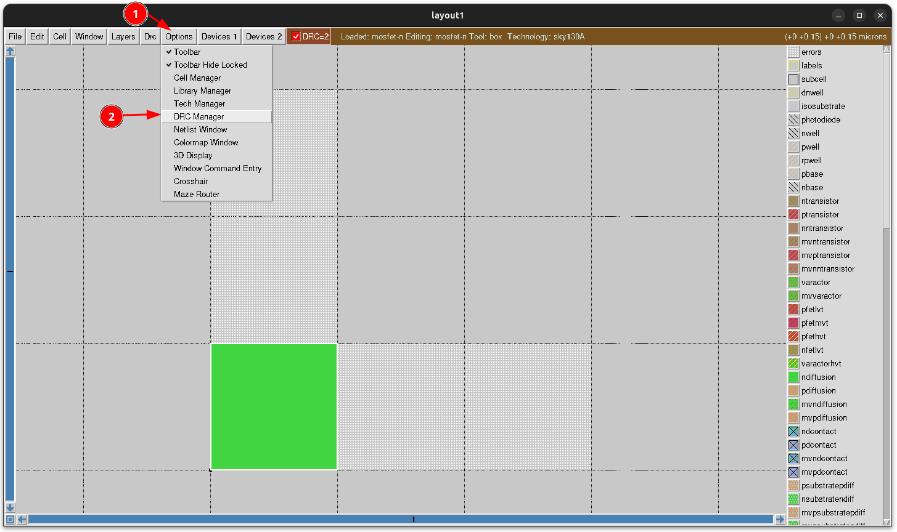
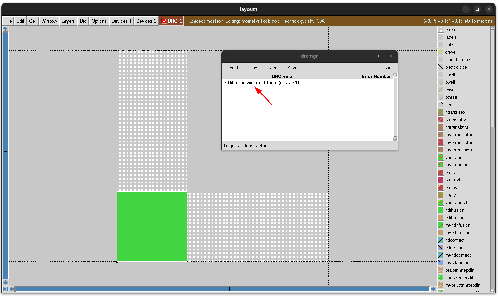

# Creando un MOSFET N

Vamos a crear nuestro primer MOSFET-N con Magic. Se construye dibujando **2 rectángulos**: uno para marcar las **zonas N**, y otro para el **polisilicio** de la **puerta**. A partir de estos dos rectángulos, magic calcula los parámetros necesarios para la fabricación del mosfet

Lo construiremos **de forma incremental**, a la vez que aprendemos las diferentes opciones de Magic, y practicamos con ellas
  
## Dibujando una Zona N mínima

La **zona N mínima** que podemos dibujar está determinada por el **tamaño del grid**, que lo hemos fichado en 0.050um x 0.050um (50nm x 50nm). Este es el tamaño que tiene la **caja** actual. Pulsamos `ctrl-z` para verlo centrado y a su mayor tamaño

Nos fijamos que se cumples **las reglas DRC** (básicamente porque NO hay diseñado nada todavía)

Para dibujar una **zona N** en la caja actual, ejecutamos este comando: `paint ndiffusion`. Esto es lo que nos aparece en la consola de magic:

En la ventana del diseño vemos que la caja se pone de **color verde**, y en los cuadrados del grid superior y derecho aparece un **patrón de puntitos**

También observamos que el **DRC FALLA**: Hay 2 errores. Esto es debido a que **NO se puede construir una zona N tan pequeña**, con la tecnología sky130, sino que hay unas **dimensiones mínima**. Pero vamos a investigar sobre esto

Para ver el diseño completo, pinchamos en **windows/full view** o bien apretamos la tecla `v`

 

Ahora se ven todas las cuadrículas nuevas. Por la parte superior hay 2 que indican la **presencia de errores**, y por la parte derecha hay otras 2 también de errores. Los patrones de relleno de estas capas se pueden ver en la parte derecha. Ahí vemos las capas `ndifussion` y `errors`

## Viendo los errores de DRC

Para ver los errores pinchamos en **Options/DRC Manager**

Se nos abre una ventana nueva, donde nos indica la regla que se está violando: `Diffusion width < 0.15um (diff/tap.1)`

Lo que significa es que la zona de difusión N tiene **unas dimensiones menores que las mínimas permitidas**. Las mínimas son de **0.15um**. Esto es lo que nos indican las cuadrículas de la capa de error: Al menos, tanto **la anchura** como **la altura** de la zona n tiene que ocupar **3 cuadrículas**

## Ampliando la anchura de la zona N

## Zona N definitiva

## Polisilicio

## Mostrando/oculatando capas

## Conectando la fuente

## Conectando la puerta

## Conexión con el sustrato

## Conexión con el drenador

