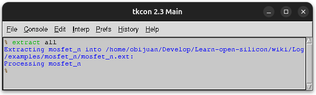
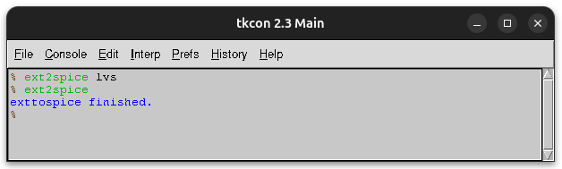
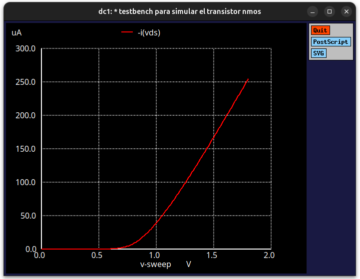
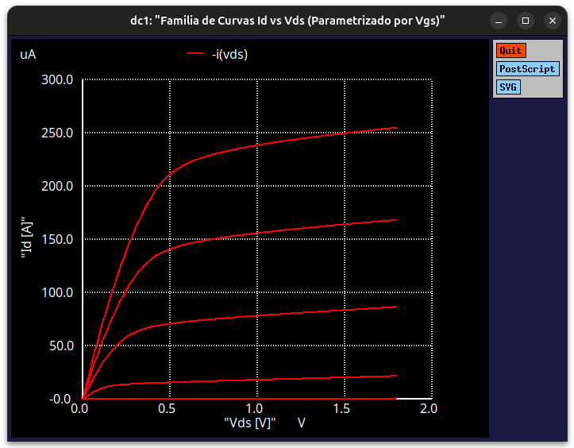

# Simulando el MOSFET N

Una vez que tenemos diseñado el MOSFET-N, el siguiente paso es **simularlo en spice**. Desde Ubuntu/Linux instalamos **ngspic** mediante el comando:

```bash
sudo apt install ngspice
```

La versión instalada es:

```bash
obijuan@JANEL:~$ ngspice --version
******
** ngspice-42 : Circuit level simulation program
** Compiled with KLU Direct Linear Solver
** The U. C. Berkeley CAD Group
** Copyright 1985-1994, Regents of the University of California.
** Copyright 2001-2023, The ngspice team.
** Please get your ngspice manual from https://ngspice.sourceforge.io/docs.html
** Please file your bug-reports at http://ngspice.sourceforge.net/bugrep.html
** Creation Date: Sun Mar 31 20:15:14 UTC 2024
******
obijuan@JANEL:~$
```

Para realizar la simulación ejecutamos primero el comando `extract all`. Esto es lo que sale:



Este comando extrae todos los parámetros del diseño y genera el fichero `mosfet_n.ext`, que es un formato utilizado por magic. Este es su contenido, que se incluye aquí por curiosidad

```
timestamp 1787215117
version 8.3
tech sky130A
style ngspice()
scale 1000 1 500000
resistclasses 4400000 2200000 950000 3050000 120000 197000 114000 191000 120000 197000 114000 191000 48200 319800 2000000 48200 48200 12800 125 125 47 47 29 5
parameters sky130_fd_pr__nfet_01v8 l=l w=w a1=as p1=ps a2=ad p2=pd
port "DRAIN" 4 350 60 350 60 m1
port "SOURCE" 1 -110 60 -110 60 m1
port "GATE" 2 -110 180 -110 180 m1
port "VSUBS" 3 -110 -110 -110 -110 m1
node "DRAIN" 170 157.292 350 60 m1 0 0 0 0 0 0 0 0 12000 440 0 0 0 0 0 0 0 0 0 0 0 0 0 0 0 0 0 0 0 0 0 0 0 0 12800 480 11200 440 0 0 0 0 0 0 0 0 0 0
node "SOURCE" 170 108.157 -110 60 m1 0 0 0 0 0 0 0 0 12000 440 0 0 0 0 0 0 0 0 0 0 0 0 0 0 0 0 0 0 0 0 0 0 0 0 12800 480 11200 440 0 0 0 0 0 0 0 0 0 0
node "GATE" 330 310.998 -110 180 m1 0 0 0 0 0 0 0 0 0 0 0 0 0 0 0 0 0 0 0 0 0 0 0 0 0 0 0 0 0 0 12800 660 0 0 12000 460 17600 600 0 0 0 0 0 0 0 0 0 0
substrate "VSUBS" 223 0 -110 -110 m1 0 0 0 0 0 0 0 0 0 0 10000 400 0 0 0 0 0 0 0 0 0 0 0 0 0 0 0 0 0 0 0 0 0 0 12800 480 11200 440 0 0 0 0 0 0 0 0 0 0
cap "DRAIN" "GATE" 9.38015
cap "GATE" "SOURCE" 71.4165
cap "DRAIN" "SOURCE" 24.8075
device msubckt sky130_fd_pr__nfet_01v8 100 0 101 1 l=40 w=120 "VSUBS" "GATE" 80 0 "SOURCE" 120 12000,440 "DRAIN" 120 12000,440
```
El siguiente paso es ejecutar estos comandos para convertir el fichero anterior al formato de spice. 

```bash
ext2spice lvs
ext2spice
``` 




Se genera el fichero `mosfet_n.spice`, cuyo contenido es el siguiente:

```spice
* NGSPICE file created from mosfet_n.ext - technology: sky130A

.subckt mosfet_n SOURCE GATE VSUBS DRAIN
X0 DRAIN GATE SOURCE VSUBS sky130_fd_pr__nfet_01v8 ad=0.3 pd=2.2 as=0.3 ps=2.2 w=0.6 l=0.2
.ends
```
Se ha creado un subcircuito de spice que tiene como parámetros los 4 puertos que se han definido: `SOURCE`, `DRAIN`, `GATE` y `VSUBS`

Para comprobar el MOSFET N hay que hacer **bancos de pruebas** en spice que sitúen las tensiones correspondientes y saquen las gráficas. Vamos a realizar **2 pruebas**, una para **medir la corriente** que atraviesa el mosfet, y la otra para sacar **las familias de curvas características**. En ambos circuitos hay que indicar **la ruta** de la **libreria spice** (sky130.lib.spice) para la tecnología **sky130**. En mi caso está instalada en el directorio `/.ciel/sky130A/libs.tech/ngspice`

* **test_mosfet_n.spice**: Comprobación de la corriente que atraviesa el transistor

```spice
* Testbench para simular el transistor NMOS
.include "mosfet_n.spice"

* Ruta al modelo del PDK Sky130
.lib "/home/obijuan/.ciel/sky130A/libs.tech/ngspice/sky130.lib.spice" tt

* ----------------------------------------------------------
* -- Instanciar el MOSFET N
* -- El orden de los parametros debe ser el mismo indicado
* -- en el fichero mosfet_n.spice
* -----------------------------------------------------------
X1  SOURCE  GATE  VSUBS DRAIN  mosfet_n

* Tensiones aplicadas al transistor
Vss SOURCE 0 DC 0V
Vds DRAIN  0 DC 1.8V
Vgs GATE   0 DC 0V
Vsub VSUBS 0 DC 0V

* Variar Vgs desde 0V hasta 1.8V en pasos de 10mV
.dc Vgs 0 1.8 0.01

.control
run
* Mostrar la gráfica de la corriente que circula por el 
* transistor en funcion de la tension que llega por la puerta
plot -i(Vds)
.endc

.end
```

Hay que ejecutar el comando `ngspice test_mosfet_n.spice`

```bash
obijuan@JANEL:~/Develop/Learn-open-silicon/wiki/Log/examples/mosfet_n$ ngspice test_mosfet_n.spice 
******
** ngspice-42 : Circuit level simulation program
** Compiled with KLU Direct Linear Solver
** The U. C. Berkeley CAD Group
** Copyright 1985-1994, Regents of the University of California.
** Copyright 2001-2023, The ngspice team.
** Please get your ngspice manual from https://ngspice.sourceforge.io/docs.html
** Please file your bug-reports at http://ngspice.sourceforge.net/bugrep.html
** Creation Date: Sun Mar 31 20:15:14 UTC 2024
******

Note: No compatibility mode selected!


Circuit: * testbench para simular el transistor nmos

Doing analysis at TEMP = 27.000000 and TNOM = 27.000000

Using SPARSE 1.3 as Direct Linear Solver
 Reference value :  0.00000e+00
No. of Data Rows : 181
ngspice 1 ->
```

Esta es la gráfica que aparece:




* **test_mosfet_n2.spice**: Familia de curvas I-V 

```spice
* Testbench para obtener la familia de curvas I-V (Id vs Vds) para varios Vgs
.include "mosfet_n.spice"

* Ruta al PDK de Sky130
.lib "/home/obijuan/.ciel/sky130A/libs.tech/ngspice/sky130.lib.spice" tt

* ----------------------------------------------------------
* -- Instanciar el MOSFET N
* -- El orden de los parametros debe ser el mismo indicado
* -- en el fichero mosfet_n.spice
* -----------------------------------------------------------
X1  SOURCE  GATE  VSUBS DRAIN  mosfet_n

* Tensiones aplicadas al transistor
Vss  SOURCE 0 DC 0V
Vds  DRAIN  0 DC 0V
Vgs  GATE   0 DC 0V
Vsub VSUBS 0 DC 0V

* Barrido anidado DC:
* 1. Barrido principal: Variar Vds de 0V a 1.8V (pasos de 10mV)
* 2. Barrido secundario: Variar Vgs de 0.6V a 1.8V en pasos de 0.3V
.dc Vds 0 1.8 0.01 Vgs 0.6 1.8 0.3

.control
run
* Dibujar la corriente de drenador para cada curva de Vgs
plot -i(Vds) xlabel "Vds [V]" ylabel "Id [A]" title "Familia de Curvas Id vs Vds (Parametrizado por Vgs)"
.endc

.end
```
Hay que ejecutar el comando `ngspice test_mosfet_n2.spice`

```bash
obijuan@JANEL:~/Develop/Learn-open-silicon/wiki/Log/examples/mosfet_n$ ngspice test_mosfet_n2.spice 
******
** ngspice-42 : Circuit level simulation program
** Compiled with KLU Direct Linear Solver
** The U. C. Berkeley CAD Group
** Copyright 1985-1994, Regents of the University of California.
** Copyright 2001-2023, The ngspice team.
** Please get your ngspice manual from https://ngspice.sourceforge.io/docs.html
** Please file your bug-reports at http://ngspice.sourceforge.net/bugrep.html
** Creation Date: Sun Mar 31 20:15:14 UTC 2024
******

Note: No compatibility mode selected!


Circuit: * testbench para obtener la familia de curvas i-v (id vs vds) para varios vgs

Doing analysis at TEMP = 27.000000 and TNOM = 27.000000

Using SPARSE 1.3 as Direct Linear Solver
 Reference value :  0.00000e+00
No. of Data Rows : 905
ngspice 1 -> 
```

Esta es la gráfica que aparece:




**¡¡El transistor está FUNCIONANDO!!!**

