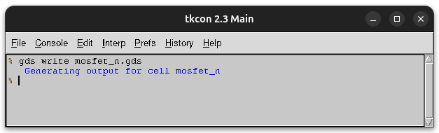

# Formato de fabricación GDS

Para la fabricación de los chips se necesita **generar un archivo** que contiene la **información** sobre todas las **máscaras** que hay que generar para la **construcción** de las diferentes capas del chip. Uno de los formatos utilizado es el [GDS](https://en.wikipedia.org/wiki/GDSII)

Desde Magic podemos generar el **archivo de fabricación** muy fácilmente con el comando `gds write`

Como ejemplo vamos a exportar el mosfet N. Una vez cargado en Magic, ejecutamos `gds write mosfet_n.gds`

Se nos genera el fichero `mosfet_n.gds`. ¡Listos para fabricar!

