# Herramienta Klayout

  🚧 DEBUG 🚧

Para visualizar los **archivos GDS** podemos utilizar la herramienta [Klayout](https://www.klayout.de/). Para instalarlo en Ubuntu hay que descargar el fichero `.deb` desde aquí: [https://www.klayout.de/build.html](https://www.klayout.de/build.html)

Yo he bajado la versión **0.30.10**. Se instala con `sudo apt install klayout_0.30.10-1_amd64.deb`. Luego hay que ejecutar `sudo apt --fix-broken install` para que se instalen todas las dependencias

Esto es lo que aparece una vez arrancado:

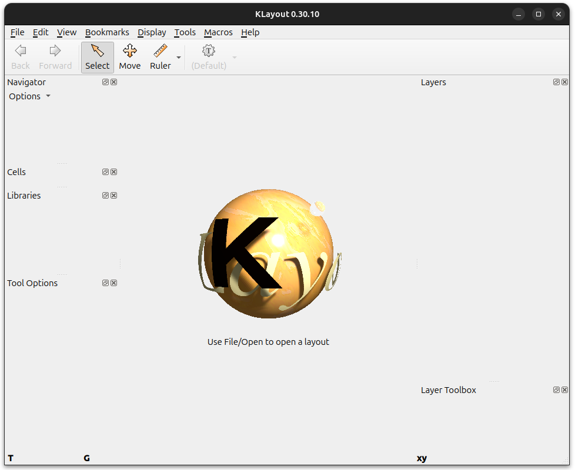

Vamos a visualizar el fichero `mosfet_n.gds` generado anteriormente. Pinchamos en **File/Open** y seleccionamos el fichero

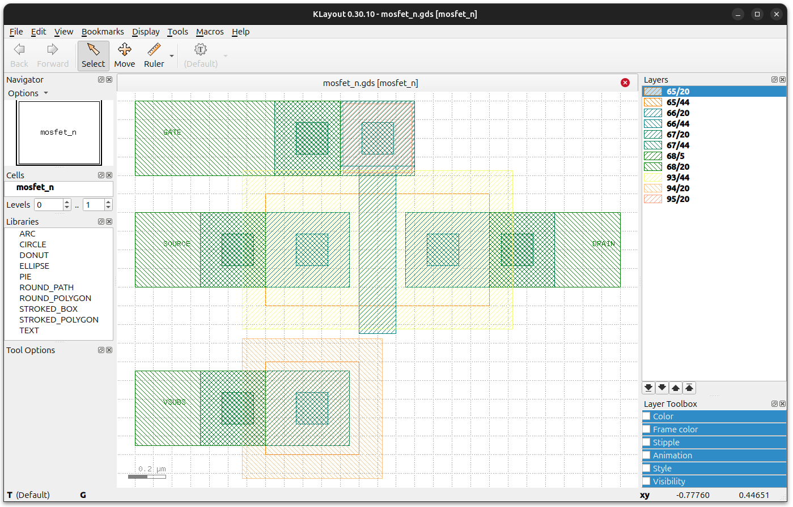

Lo interesante de esta herramienta es que **también puede abrir los ficheros de Magic**. Abrimos el fichero `mosfet_n.mag` para comprobarlo:

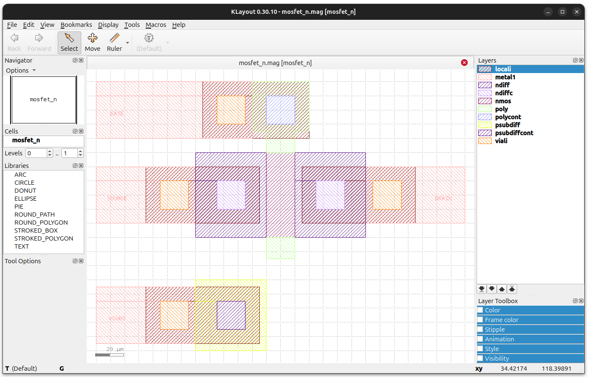

## Visualizacion en 3D

Desde Klayout también se puede visualizar el archivo .gds en 3D. Para ello hay que seguir los siguientes pasos

* Instalar el paquete **Efabless_sky130** de KLayout

Entrar en el menú en **Tools/Manage packages**

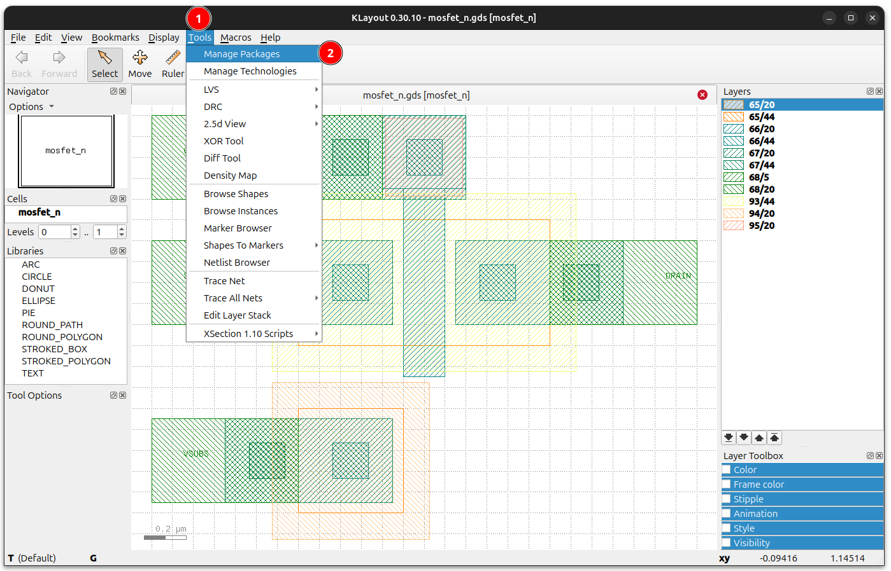

Buscar `sky130`. De los paquetes que aparecen, seleccionar **Efabless sky130** y pinchar en **Apply**

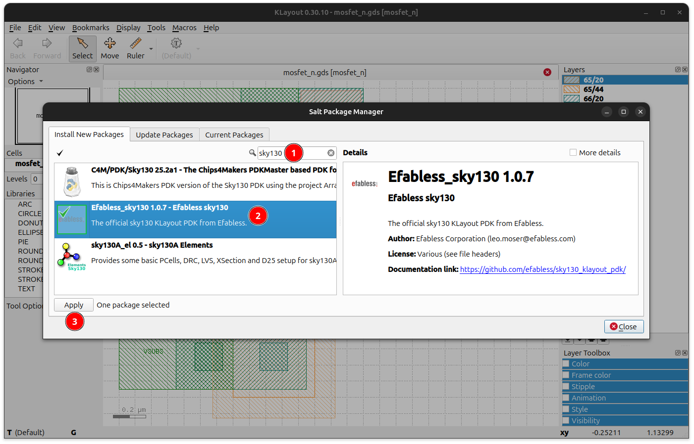

Pulsamos en **OK** 

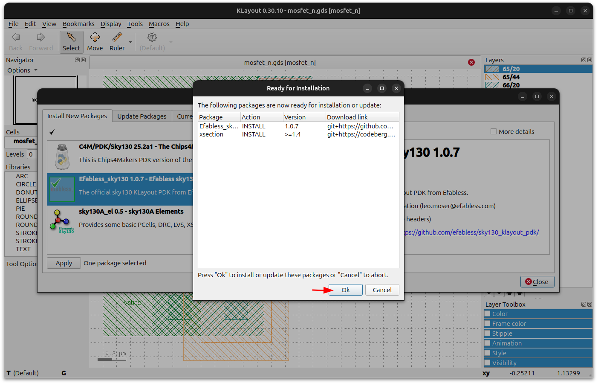

Se empiezan a instalar los paquetes

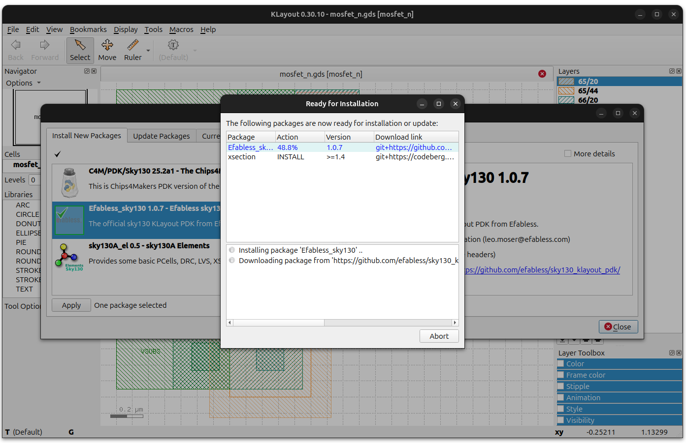

Cuando se termina, pinchamos en **Close**

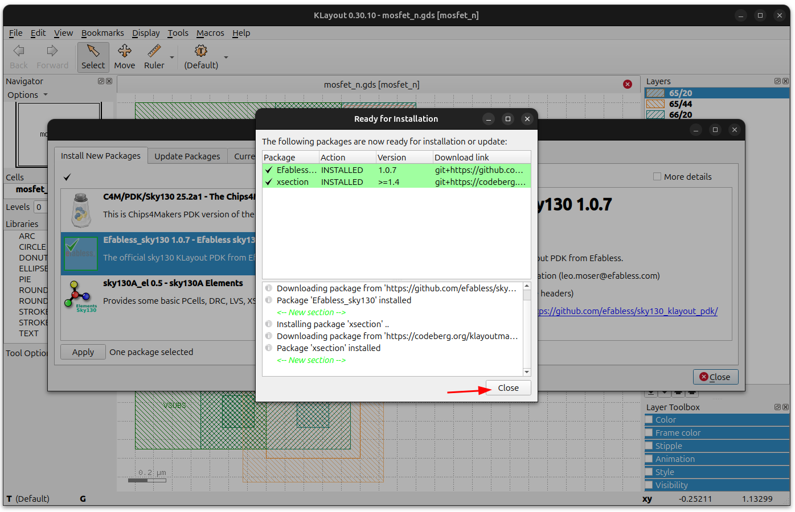

En el siguiente diálogo que aparece pinchamos en **YES**

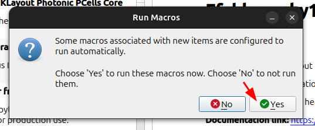

Ahora vamos a la opción **Tools/2.5d View/New 2.5d script**

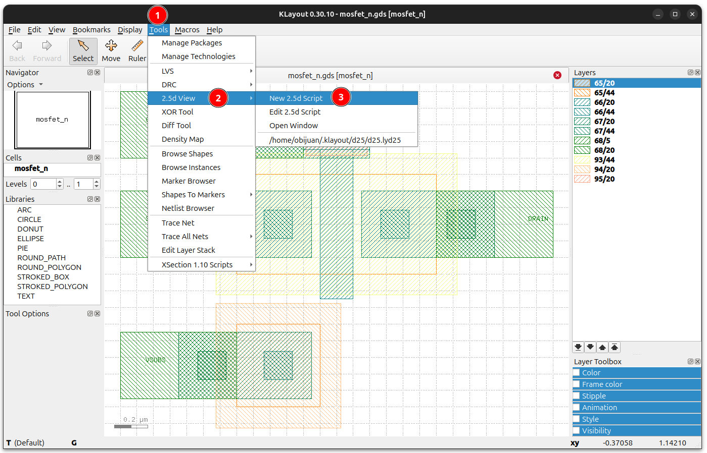

Desplegamos donde pone **Technology sky130**

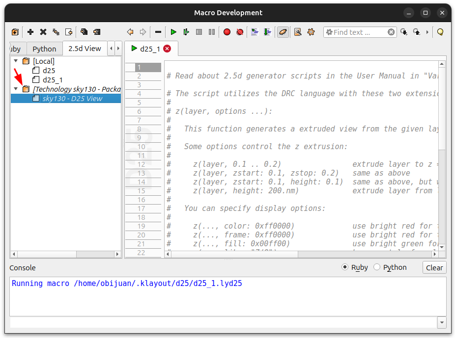

Hacemos **doble click** en **Sky130 - D25 View**. Se nos abre un script en la pestaña **sky130**. Pinchamos en **Run script from the current tab**

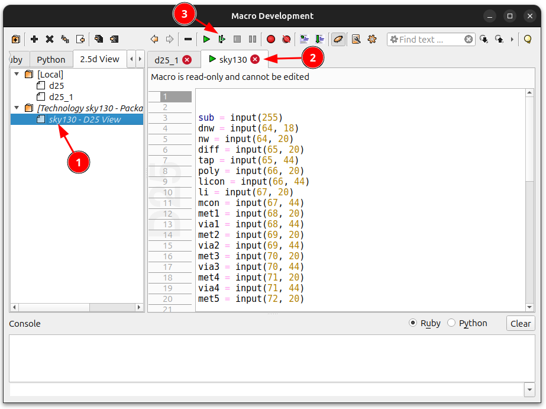

Y se nos abre la **venta 3D!!**. Con el **ratón** y los **deslizantes superiores** ajustamos la vista a lo que nos interese

